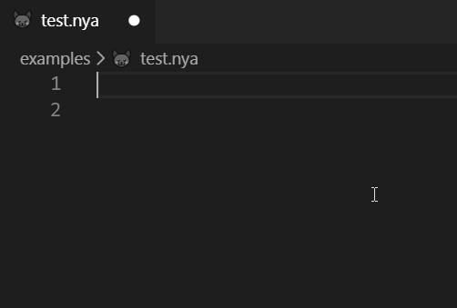

# vscode-nyancat

This extension provides nyancat language support for Visual Studio Code.

## Features

 - Syntax highlighting
 - Snippets for all the available tasks
 - Additional useful snippets

## Requirements

This extension is intended to be used to write codes with the [nyancat C library](http://github.com/thzoid/nyancat)!

## Known Issues

 - No diagnostics provider;
 - No semantic highlighting.

**Enjoy!**
